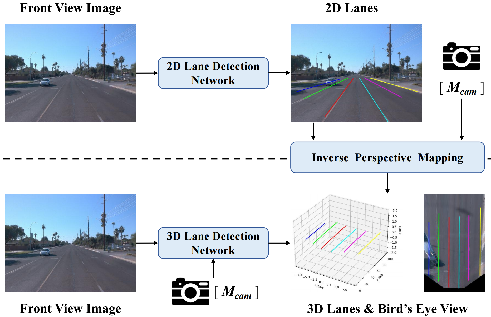
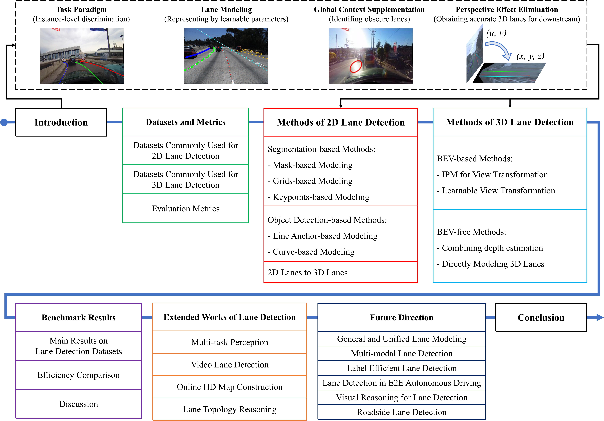
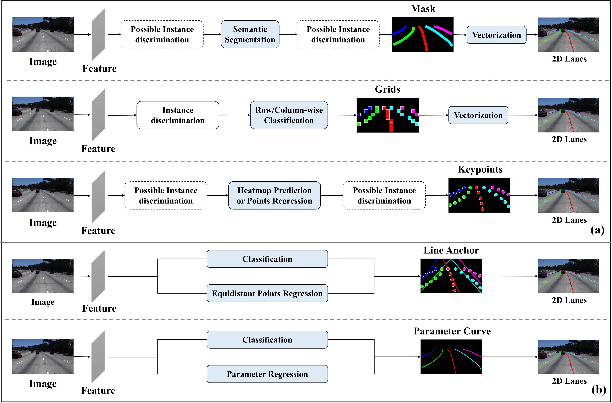
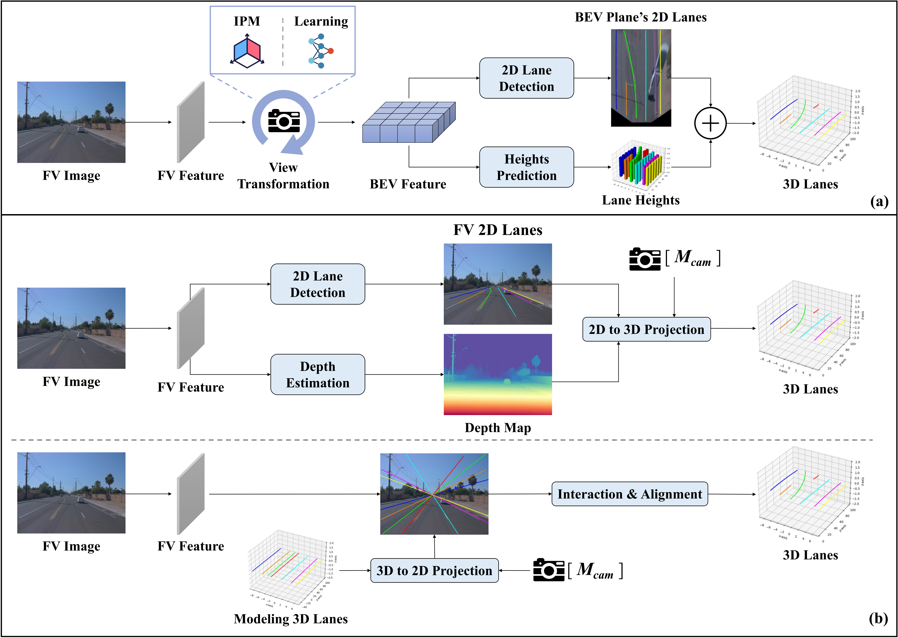

# Awesome-Lane-Detection

This repository is used for recording and tracking recent monocular lane detection methods, as a supplement to our [survey paper](https://arxiv.org/abs/2411.16316):

> **Title:** Monocular Lane Detection Based on Deep Learning: A Survey  
> **Authors:** Xin He, Haiyun Guo, Kuan Zhu, Bingke Zhu, Xu Zhao, Jianwu Fang, Jinqiao Wang 
> arXiv preprint arXiv:2411.16316 

**This repository will be constantly updated.** If you find any work missing or have any suggestions (papers, implementations and other resources), feel free to [pull requests](https://github.com/Core9724/Awesome-Lane-Detection/pulls). We will add the missing papers to this repo ASAP.

## Overview

## Summary of Contents

- [Methods of 2D Lane Detection](#Methods-of-2D-Lane-Detection)
	- [Segmentation-based Methods](#Segmentation-based-Methods)
	- [Object detection-based Methods](#Object-detection-based-Methods)
- [Methods of 3D Lane Detection](#Methods-of-3D-Lane-Detection)
	- [BEV-based Methods](#BEV-based-Methods)
	- [BEV-free Methods](#BEV-free-Methods)
- [Extended Works of Lane Detection](#Extended-Works-of-Lane-Detection)
	- [Multi-task Perception](#Multi-task-Perception)
	- [Video Lane Detection](#Video-Lane-Detection)
	- [Online HD Map Construction](#Online-HD-Map-Construction)
	- [Lane Topology Reasoning](#Lane-Topology-Reasoning)
- [Future Direction](#Future-Direction)

## Methods of 2D Lane Detection

**(a)Segmentation-based methods** (two-stage), which complete lane recognition and instance discrimination in a certain order, and leverage mask, grids or keypoints to model lanes.

**(b)Object detection-based methods** (one-stage), which can directly perform instance discrimination and localization concurrently, and leverage line anchor or parameter curve to model lanes.

### Segmentation-based Methods

"↑" represents a bottom-up approach, usually distinguishing all lane foreground first, and then obtaining each lane instance through heuristic post-processing. 

"↓" represents a top-down approach, which first identifies all instances and then predicts the specific location of each lane. "Max Lanes" means predefined maximum number of lanes in advance, which can be referred to in [SCNN](https://arxiv.org/abs/1712.06080). “Dynamic kernels” denotes the method of predicting dynamic instance kernels to distinguish different instances, which can be referred to the classic instance segmentation methods [Condinst](https://link.springer.com/chapter/10.1007/978-3-030-58452-8_17) and [SOLOv2](https://arxiv.org/abs/2003.10152).

"None" indicates that the paper does not clearly indicate how to distinguish instances of different lanes.

|        Methods        |      Venue      | Title                                                        |                          Paper/Code                          | Instance Discrimination | Lane Modeling |
| :-------------------: | :-------------: | ------------------------------------------------------------ | :----------------------------------------------------------: | :---------------------: | :-----------: |
|      **VPGNet**       |  **ICCV 2017**  | VPGNet: Vanishing Point Guided Network for Lane and Road Marking Detection and Recognition | [Paper](https://arxiv.org/abs/1710.06288)/[Code](https://github.com/SeokjuLee/VPGNet) |            ↑            |   **Mask**    |
|      **LaneNet**      |   **IV 2018**   | Towards End-to-End Lane Detection: an Instance Segmentation Approach | [Paper](https://arxiv.org/abs/1802.05591)/[Code](https://github.com/MaybeShewill-CV/lanenet-lane-detection) |            ↑            |   **Mask**    |
|      **LaneNet**      | **Arxiv 2018**  | LaneNet: Real-Time Lane Detection Networks for Autonomous Driving |        [Paper](https://arxiv.org/abs/1807.01726)/Code        |            ↑            |   **Mask**    |
|       **SCNN**        |  **AAAI 2018**  | Spatial As Deep: Spatial CNN for Traffic Scene Understanding | [Paper](https://arxiv.org/abs/1712.06080)/[Code](https://github.com/harryhan618/SCNN_Pytorch) |      ↓ (Max Lanes)      |   **Mask**    |
|        **LMD**        |  **DSP 2018**   | Efficient Road Lane Marking Detection with Deep Learning     |        [Paper](https://arxiv.org/abs/1809.03994)/Code        |            ↑            |   **Mask**    |
|      **EL-GAN**       | **ECCVW 2018**  | EL-GAN: Embedding Loss Driven Generative Adversarial Networks for Lane Detection | [Paper](https://arxiv.org/abs/1806.05525)/[Code](https://github.com/ibrahimgh25/EL-GAN-Implementation) |      ↓ (Max Lanes)      |   **Mask**    |
| ***Chougule et al.*** | **ECCVW 2018**  | Reliable multilane detection and classification by utilizing CNN as a regression network | [Paper](https://openaccess.thecvf.com/content_eccv_2018_workshops/w30/html/Chougule_Reliable_multilane_detection_and_classification_by_utilizing_CNN_as_a_ECCVW_2018_paper.html)/Code |      ↓ (Max Lanes)      | **Keypoints** |
|        **SAD**        |  **ICCV 2019**  | Learning Lightweight Lane Detection CNNs by Self Attention Distillation | [Paper](https://arxiv.org/abs/1908.00821)/[Code](https://github.com/cardwing/Codes-for-Lane-Detection) |      ↓(Max Lanes)       |   **Mask**    |
|     **FastDraw**      |  **ICCV 2019**  | FastDraw: Addressing the Long Tail of Lane Detection by Adapting a Sequential Prediction Network |        [Paper](https://arxiv.org/abs/1905.04354)/Code        |            ↑            |   **Mask**    |
|     **IntRA-KD**      |  **CVPR 2020**  | Inter-Region Affinity Distillation for Road Marking Segmentation | [Paper](https://arxiv.org/abs/2004.05304)/[Code](https://arxiv.org/abs/2004.05304) |      ↓ (Max Lanes)      |   **Mask**    |
|      **SALMNet**      |  **TITS 2020**  | SALMNet: A Structure-Aware Lane Marking Detection Network    |  [Paper](https://ieeexplore.ieee.org/document/9061152)/Code  |          None           |   **Mask**    |
|    **Ripple-GAN**     |  **TITS 2020**  | Ripple-GAN: Lane Line Detection With Ripple Lane Line Detection Network and Wasserstein GAN |                        [Paper]()/Code                        |          None           |   **Mask**    |
|       **PINet**       |  **TITS 2020**  | Key Points Estimation and Point Instance Segmentation Approach for Lane Detection | [Paper](https://arxiv.org/abs/2002.06604)/[Code](https://github.com/koyeongmin/PINet_new) |            ↑            | **Keypoints** |
|      **E2E-LMD**      | **CVPRW 2020**  | End-to-End Lane Marker Detection via Row-wise Classification |        [Paper](https://arxiv.org/abs/2005.08630)/Code        |      ↓(Max Lanes)       | **Keypoints** |
|       **UFLD**        |  **ECCV 2020**  | Ultra Fast Structure-aware Deep Lane Detection               | [Paper](https://arxiv.org/abs/2004.11757)/[Code](https://github.com/cfzd/Ultra-Fast-Lane-Detection) |      ↓(Max Lanes)       |   **Grids**   |
|       **RESA**        |  **AAAI 2021**  | RESA: Recurrent Feature-Shift Aggregator for Lane Detection  | [Paper](https://arxiv.org/abs/2008.13719)/[Code](https://github.com/ZJULearning/resa) |      ↓(Max Lanes)       |   **Mask**    |
|     **FOLOLane**      |  **CVPR 2021**  | Focus on Local: Detecting Lane Marker from Bottom Up via Key Point |        [Paper](https://arxiv.org/abs/2105.13680)/Code        |            ↑            | **Keypoints** |
|    **CondLaneNet**    |  **ICCV 2021**  | CondLaneNet: a Top-to-down Lane Detection Framework Based on Conditional Convolution | [Paper](https://arxiv.org/abs/2105.05003)/[Code](https://github.com/aliyun/conditional-lane-detection) |   ↓(Dynamic Kernels)    |   **Grids**   |
|      **LaneAF**       |  **RAL 2021**   | LaneAF: Robust Multi-Lane Detection with Affinity Fields     | [Paper](https://arxiv.org/abs/2103.12040)/[Code](https://github.com/sel118/LaneAF) |            ↑            |   **Mask**    |
|       **GANet**       |  **CVPR 2022**  | A Keypoint-based Global Association Network for Lane Detection | [Paper](https://arxiv.org/abs/2204.07335)/[Code](https://arxiv.org/abs/2204.07335) |            ↑            | **Keypoints** |
|      **UFLDv2**       | **TPAMI 2022**  | Ultra Fast Deep Lane Detection with Hybrid Anchor Driven Ordinal Classification | [Paper](https://arxiv.org/abs/2206.07389)/[Code](https://github.com/cfzd/Ultra-Fast-Lane-Detection-v2) |      ↓(Max Lanes)       |   **Grids**   |
|      **RCLane**       |  **ECCV 2022**  | RCLane: Relay Chain Prediction for Lane Detection            | [Paper](https://arxiv.org/abs/2207.09399)/[Code](https://github.com/lpplbiubiubiub/RCLane) |            ↑            | **Keypoints** |
|       **CANet**       | **ICASSP 2023** | CANet: Curved Guide Line Network with Adaptive Decoder for Lane Detection |        [Paper](https://arxiv.org/abs/2304.11546)/Code        |   ↓(Dynamic Kernels)    |   **Grids**   |
|     **PriorLane**     |  **ICRA 2023**  | PriorLane: A Prior Knowledge Enhanced Lane Detection Approach Based on Transformer | [Paper](https://arxiv.org/abs/2209.06994)/[Code](https://github.com/vincentqqb/PriorLane) |      ↓(Max Lanes)       |   **Mask**    |
|     **CondLSTR**      |  **ICCV 2023**  | Generating Dynamic Kernels via Transformers for Lane Detection | [Paper](https://openaccess.thecvf.com/content/ICCV2023/html/Chen_Generating_Dynamic_Kernels_via_Transformers_for_Lane_Detection_ICCV_2023_paper.html)/[Code](https://github.com/czyczyyzc/CondLSTR?tab=readme-ov-file#generating-dynamic-kernels-via-transformers-for-lane-detection) |   ↓(Dynamic Kernels)    | **Keypoints** |
|    **LanePtrNet**     | **Arxiv 2024**  | LanePtrNet: Revisiting Lane Detection as Point Voting and Grouping on Curves |        [Paper](https://arxiv.org/abs/2403.05155)/Code        |            ↑            | **Keypoints** |

### Object Detection-based Methods

|        Methods        |     Venue      | Title                                                        |                          Paper/Code                          |          Lane Modeling          |
| :-------------------: | :------------: | ------------------------------------------------------------ | :----------------------------------------------------------: | :-----------------------------: |
|     **Line-CNN**      | **TITS 2019**  | Line-CNN: End-to-End Traffic Line Detection With Line Proposal Unit | [Paper](https://ieeexplore.ieee.org/abstract/document/8624563)/Code |         **Line Anchor**         |
|   **PointLaneNet**    |  **IV 2019**   | PointLaneNet: Efficient end-to-end CNNs for Accurate Real-Time Lane Detection |  [Paper](https://ieeexplore.ieee.org/document/8813778)/Code  |         **Line Anchor**         |
|   **CurveLane-NAS**   | **ECCV 2020**  | CurveLane-NAS: Unifying Lane-Sensitive Architecture Search and Adaptive Point Blending | [Paper](https://arxiv.org/abs/2007.12147)/[Code](https://github.com/SoulmateB/CurveLanes) |         **Line Anchor**         |
|    **PolyLaneNet**    | **ICPR 2020**  | PolyLaneNet: Lane Estimation via Deep Polynomial Regression  | [Paper](https://arxiv.org/abs/2004.10924)/[Code](https://github.com/lucastabelini/PolyLaneNet) |         **Polynomial**          |
|      **LaneATT**      | **CVPR 2021**  | Keep your Eyes on the Lane: Real-time Attention-guided Lane Detection | [Paper](https://arxiv.org/abs/2010.12035)/[Code](https://github.com/lucastabelini/LaneATT) |         **Line Anchor**         |
|       **SGNet**       | **IJCAI 2021** | Structure Guided Lane Detection                              |        [Paper](https://arxiv.org/abs/2105.05403)/Code        |         **Line Anchor**         |
|       **LSTR**        | **WACV 2021**  | End-to-end Lane Shape Prediction with Transformers           | [Paper](https://arxiv.org/abs/2011.04233)/[Code](https://github.com/liuruijin17/LSTR) |         **Polynomial**          |
|    **LaneFormer**     | **AAAI 2022**  | Laneformer: Object-aware Row-Column Transformers for Lane Detection |        [Paper](https://arxiv.org/abs/2203.09830)/Code        |         **Line Anchor**         |
|    **Eigenlanes**     | **CVPR 2022**  | Eigenlanes: Data-Driven Lane Descriptors for Structurally Diverse Lanes | [Paper](https://arxiv.org/abs/2203.09830)/[Code](https://github.com/dongkwonjin/Eigenlanes) |         **Line Anchor**         |
|      **CLRNet**       | **CVPR 2022**  | CLRNet: Cross Layer Refinement Network for Lane Detection    | [Paper](https://arxiv.org/abs/2203.10350)/[Code](https://github.com/Turoad/clrnet) |         **Line Anchor**         |
|   **BézierLaneNet**   | **CVPR 2022**  | Rethinking Efficient Lane Detection via Curve Modeling       | [Paper](https://arxiv.org/abs/2203.02431)/[Code](https://github.com/voldemortX/pytorch-auto-drive) |        **Bézier Curve**         |
|     **O2SFormer**     | **Arxiv 2023** | End-to-End Lane detection with One-to-Several Transformer    | [Paper](https://arxiv.org/abs/2305.00675)/[Code](https://arxiv.org/abs/2305.00675) |         **Line Anchor**         |
|      **PGA-Net**      | **TITS 2023**  | PGA-Net: Polynomial Global Attention Network With Mean Curvature Loss for Lane Detection | [Paper](https://ieeexplore.ieee.org/document/10247094)/[Code](https://github.com/qklee-lz/PGA-Net) |         **Polynomial**          |
|       **ADNet**       | **ICCV 2023**  | ADNet: Lane Shape Prediction via Anchor Decomposition        | [Paper](https://arxiv.org/abs/2308.10481)/[Code](https://github.com/Sephirex-X/ADNet) |         **Line Anchor**         |
|    **CLRmatchNet**    | **Arxiv 2023** | CLRmatchNet: Enhancing Curved Lane Detection with Deep Matching Process | [Paper](https://arxiv.org/abs/2309.15204)/[Code](https://github.com/sapirkontente/CLRmatchNet) |         **Line Anchor**         |
|     **CLRerNet**      | **WACV 2024**  | CLRerNet: Improving Confidence of Lane Detection with LaneIoU | [Paper](https://github.com/hirotomusiker/CLRerNet)/[Code](https://github.com/hirotomusiker/CLRerNet) |         **Line Anchor**         |
|      **SRLane**       | **AAAI 2024**  | Sketch and Refine: Towards Fast and Accurate Lane Detection  | [Paper](https://arxiv.org/abs/2401.14729)/[Code](https://github.com/passerer/SRLane) |         **Line Anchor**         |
|      **HGLNet**       | **AAAI 2024**  | A Hybrid Global-Local Perception Network for Lane Detection  | [Paper](https://ojs.aaai.org/index.php/AAAI/article/view/27858)/Code |         **Line Anchor**         |
|      **GSENet**       | **AAAI 2024**  | GSENet: Global Semantic Enhancement Network for Lane Detection | [Paper](https://ojs.aaai.org/index.php/AAAI/article/view/29433)/Code |         **Line Anchor**         |
|       **LDTR**        |  **CVM 2024**  | LDTR: Transformer-based Lane Detection with Anchor-chain Representation |        [Paper](https://arxiv.org/abs/2403.14354)/Code        | **Anchor-chain(uniform point)** |
| **Sparse Laneformer** | **Arxiv 2024** | Sparse Laneformer                                            |        [Paper](https://arxiv.org/abs/2404.07821)/Code        |         **Line Anchor**         |

## Methods of 3D Lane Detection

**(a)BEV-based Methods**. The core is the **view transformation** from FV features to BEV features, including IPM and learning approach.

**(b)BEV-free Methods**. There are two branches: one is to project 2D lanes into 3D space based on **depth estimation** results, and the other is to **directly model 3D lanes** and project them back into FV for interaction and alignment.

### BEV-based Methods

|      Methods       |     Venue      | Title                                                        | Paper/Code                                                   |             View Transformation             |      Task Paradigm       |   Lane Modeling    |
| :----------------: | :------------: | ------------------------------------------------------------ | ------------------------------------------------------------ | :-----------------------------------------: | :----------------------: | :----------------: |
|   **3D-LaneNet**   | **ICCV 2019**  | 3D-LaneNet: End-to-End 3D Multiple Lane Detection            | [Paper](https://arxiv.org/abs/1811.10203)/Code               |                   **IPM**                   |           ODet           |  **Line Anchor**   |
|  **Gen-LaneNet**   | **ECCV 2020**  | Gen-LaneNet: A Generalized and Scalable Approach for 3D Lane Detection | [Paper](https://arxiv.org/abs/2003.10656)/[Code](https://github.com/yuliangguo/Pytorch_Generalized_3D_Lane_Detection) |                   **IPM**                   |           ODet           |  **Line Anchor**   |
| ***Efrat et al.*** | **Arxiv 2023** | Semi-Local 3D Lane Detection and Uncertainty Estimation      | [Paper](https://arxiv.org/abs/2003.05257)/Code               |                   **IPM**                   |         Seg - ↑          |   **Keypoints**    |
|  **3D-LaneNet+**   | **Arxiv 2020** | 3D-LaneNet+: Anchor Free Lane Detection using a Semi-Local Representation | [Paper](https://arxiv.org/abs/2011.01535)/Code               |                   **IPM**                   |         Seg - ↑          |   **Keypoints**    |
|      **CLGo**      | **AAAI 2022**  | Learning to Predict 3D Lane Shape and Camera Pose from a Single Image via Geometry Constraints | [Paper](https://arxiv.org/abs/2112.15351)/[Code](https://github.com/liuruijin17/CLGo) |                   **IPM**                   |           ODet           |   **Polynomial**   |
|  ***Li et al.***   | **CVPRW 2022** | Reconstruct from top view: A 3d lane detection approach based on geometry structure prior | [Paper](https://openaccess.thecvf.com/content/CVPR2022W/WAD/html/Li_Reconstruct_From_Top_View_A_3D_Lane_Detection_Approach_Based_CVPRW_2022_paper.html)/Code |                   **IPM**                   |           ODet           |  **Line Anchor**   |
|   **PersFormer**   | **ECCV 2022**  | PersFormer: 3D Lane Detection via Perspective Transformer and the OpenLane Benchmark | [Paper](https://arxiv.org/abs/2203.11089)/[Code](https://github.com/OpenDriveLab/PersFormer_3DLane) |               **PersFormer**                |           ODet           |  **Line Anchor**   |
|  **BEV-LaneDet**   | **CVPR 2023**  | BEV-LaneDet: a Simple and Effective 3D Lane Detection Baseline | [Paper](https://arxiv.org/abs/2210.06006)/[Code](https://github.com/gigo-team/bev_lane_det) | **[VPN](https://arxiv.org/abs/1906.03560)** |         Seg - ↑          |   **Keypoints**    |
|  **3D-SplineNet**  | **WACV 2023**  | 3D-SpLineNet: 3D Traffic Line Detection using Parametric Spline Representations | [Paper](https://openaccess.thecvf.com/content/WACV2023/html/Pittner_3D-SpLineNet_3D_Traffic_Line_Detection_Using_Parametric_Spline_Representations_WACV_2023_paper.html)/Code |                   **IPM**                   |           ODet           | **B-Spline Curve** |
| ***Chen et al.***  | **Arxiv 2023** | An Efficient Transformer for Simultaneous Learning of BEV and Lane Representations in 3D Lane Detection | [Paper](https://arxiv.org/abs/2306.04927)/Code               |         **Decomposed Transformer**          | Seg - ↓(Dynamic Kernels) |   **Keypoints**    |
|  ***Yao et al.***  | **ICCV 2023**  | Sparse Point Guided 3D Lane Detection                        | [Paper](https://openaccess.thecvf.com/content/ICCV2023/html/Yao_Sparse_Point_Guided_3D_Lane_Detection_ICCV_2023_paper.html)/[Code](https://github.com/YaoChengTang/Sparse-Point-Guided-3D-Lane-Detection) |             ****PersFormer****              |           ODet           |  **Line Anchor**   |
|   **GroupLane**    | **Arxiv 2023** | GroupLane: End-to-End 3D Lane Detection with Channel-wise Grouping | [Paper](https://arxiv.org/abs/2307.09472)/Code               | **[LSS](https://arxiv.org/abs/2008.05711)** |   Seg - ↓(Group Conv)    |     **Grids**      |
|    **LaneCPP**     | **CVPR 2024**  | LaneCPP: Continuous 3D Lane Detection using Physical Priors  | [Paper](https://arxiv.org/abs/2406.08381))/Code              | **[LSS](https://arxiv.org/abs/2008.05711)** |           ODet           | **B-Spline Curve** |

### BEV-free Methods

Although **PVALane** constructs BEV feature, BEV feature are only used to assist in enhancing the 3D lane detection effect, rather than being a necessary component of the network like the BEV-based method.

|     Methods      |     Venue      | Title                                                        | Paper/Code                                                   | Task Paradigm |    Lane Modeling    |
| :--------------: | :------------: | ------------------------------------------------------------ | ------------------------------------------------------------ | :-----------: | :-----------------: |
|    **SALAD**     | **CVPR 2022**  | ONCE-3DLanes: Building Monocular 3D Lane Detection           | [Paper](https://arxiv.org/abs/2205.00301)/[Code](https://github.com/once-3dlanes/once_3dlanes_benchmark) |    Seg - ↑    |      **Mask**       |
| **CurveFormer**  | **ICRA 2023**  | CurveFormer: 3D Lane Detection by Curve Propagation with Curve Queries and Attention | [Paper](https://arxiv.org/abs/2209.07989)/Code               |     ODet      | **3D  Line Anchor** |
| **Anchor3DLane** | **CVPR 2023**  | Anchor3DLane: Learning to Regress 3D Anchors for Monocular 3D Lane Detection | [Paper](https://arxiv.org/abs/2301.02371)/[Code](https://github.com/tusen-ai/Anchor3DLane) |     ODet      | **3D Line Anchor**  |
|     **LATR**     | **ICCV 2023**  | LATR: 3D Lane Detection from Monocular Images with Transformer | [Paper](https://arxiv.org/abs/2308.04583)/[Code](https://github.com/JMoonr/LATR) |     ODet      | **3D  Line Anchor** |
| **DecoupleLane** | **Arxiv 2023** | Decoupling the Curve Modeling and Pavement Regression for Lane Detection | [Paper](https://arxiv.org/abs/2309.10533)/Code               |     ODet      |  **3D Polynomial**  |
|   **PVALane**    | **AAAI 2024**  | PVALane: Prior-Guided 3D Lane Detection with View-Agnostic Feature | [Paper](https://ojs.aaai.org/index.php/AAAI/article/view/28592)/Code |     ODet      | **3D Line Anchor**  |
| **BézierFormer** | **ICME 2024**  | BézierFormer: A Unified Architecture for 2D and 3D Lane Detection | [Paper](https://arxiv.org/abs/2404.16304)/Code               |     ODet      | **3D Bézier Curve** |

## Extended Works of Lane Detection

There are also some works that have received widespread attention in recent years, which are closely related to lane detection. In terms of task flow, they can be regarded as an upgrade on monocular image lane detection.

### Multi-task Perception

|       Methods       | 2D/3D Lane |     Venue      | Title                                                        | Paper/Code                                                   |
| :-----------------: | :--------: | :------------: | ------------------------------------------------------------ | ------------------------------------------------------------ |
|     **DLT-Net**     |   **2D**   | **TITS 2019**  | DLT-Net: Joint Detection of Drivable Areas, Lane Lines, and Traffic Objects | [Paper](https://ieeexplore.ieee.org/document/8937825)/Code   |
|      **YOLOP**      |   **2D**   |  **MIR 2022**  | YOLOP: You Only Look Once for Panoptic Driving Perception    | [Paper](https://arxiv.org/abs/2108.11250)/[Code](https://arxiv.org/abs/2108.11250) |
|   **HybridNets**    |   **2D**   | **Arxiv 2022** | HybridNets: End-to-End Perception Network                    | [Paper](https://arxiv.org/abs/2203.09035)/[Code](https://github.com/datvuthanh/HybridNets) |
|     **YOLOPv2**     |   **2D**   | **Arxiv 2022** | YOLOPv2: Better, Faster, Stronger for Panoptic Driving Perception | [Paper](https://arxiv.org/abs/2208.11434)/[Code](https://github.com/CAIC-AD/YOLOPv2) |
|   **TwinLiteNet**   |   **2D**   | **MAPR 2023**  | TwinLiteNet: An Efficient and Lightweight Model for Driveable Area and Lane Segmentation in Self-Driving Cars | [Paper](https://arxiv.org/abs/2307.10705)/[Code](https://github.com/chequanghuy/TwinLiteNet) |
|     **Q-YOLOP**     |   **2D**   | **ICMEW 2023** | Q-YOLOP: Quantization-aware You Only Look Once for Panoptic Driving Perception | [Paper](https://arxiv.org/abs/2307.04537)/Code               |
|     **A-YOLOM**     |   **2D**   |  **TVT 2024**  | You Only Look at Once for Real-time and Generic Multi-Task   | [Paper](https://arxiv.org/abs/2310.01641)/[Code](https://github.com/JiayuanWang-JW/YOLOv8-multi-task) |
| **TwinLiteNetPlus** |   **2D**   | **Arxiv 2024** | TwinLiteNetPlus: A Stronger Model for Real-time Drivable Area and Lane Segmentation | [Paper](https://arxiv.org/abs/2403.16958)/Code               |
|     **PETRv2**      |   **3D**   | **ICCV 2023**  | PETRv2: A Unified Framework for 3D Perception from Multi-Camera Images | [Paper](https://arxiv.org/abs/2206.01256)/[Code](https://github.com/megvii-research/PETR) |
|      **RFTR**       |   **3D**   | **ECCV 2024**  | RepVF: A Unified Vector Fields Representation for Multi-task 3D Perception | [Paper](https://arxiv.org/abs/2407.10876)/[Code](https://github.com/jbji/RepVF) |

### Video Lane Detection

|        Methods        | 2D/3D Lane |      Venue      | Title                                                        | Paper/Code                                                   |
| :-------------------: | :--------: | :-------------: | :----------------------------------------------------------- | ------------------------------------------------------------ |
|   ***Zou et al.***    |   **2D**   |  **TVT 2020**   | Robust Lane Detection from Continuous Driving Scenes Using Deep Neural Networks | [Paper](https://arxiv.org/abs/1903.02193)/[Code](https://github.com/qinnzou/Robust-Lane-Detection) |
|  ***Zhang et al.***   |   **2D**   |  **TITS 2021**  | Lane Detection Model Based on Spatio-Temporal Network With Double Convolutional Gated Recurrent Units | [Paper](https://arxiv.org/abs/2008.03922)/Code               |
|      **MMA-Net**      |   **2D**   |  **ICCV 2021**  | VIL-100: A New Dataset and A Baseline Model for Video Instance Lane Detection | [Paper](https://arxiv.org/abs/2108.08482)/[Code](https://github.com/yujun0-0/MMA-Net) |
| ***Tabelini et al.*** |   **2D**   | **IJCNN 2022**  | Lane marking detection and classification using spatial-temporal feature pooling | [Paper](https://ieeexplore.ieee.org/document/9892478)/Code   |
|      **TGC-Net**      |   **2D**   | **ACM MM 2022** | Video instance lane detection via deep temporal and geometry consistency constraints | [Paper](https://dl.acm.org/doi/abs/10.1145/3503161.3547914)/Code |
|       **RVLD**        |   **2D**   |  **ICCV 2023**  | Recursive Video Lane Detection                               | [Paper](https://arxiv.org/abs/2308.11106)/[Code](https://github.com/dongkwonjin/RVLD) |
|        **OMR**        |   **2D**   |  **ECCV 2024**  | OMR: Occlusion-Aware Memory-Based Refinement for Video Lane Detection | [Paper](https://arxiv.org/abs/2408.07486)/[Code](https://github.com/dongkwonjin/OMR) |
|     **ST3DLane**      |   **3D**   |  **BMVC 2022**  | Spatio-Temporal Fusion-based Monocular 3D Lane Detection     | [Paper](https://bmvc2022.mpi-inf.mpg.de/314/)/Code           |
|   **CurveFormre++**   |   **3D**   | **Arxiv 2024**  | CurveFormer++: 3D Lane Detection by Curve Propagation with Temporal Curve Queries and Attention | [Paper](https://arxiv.org/abs/2402.06423)/Code               |

### Online HD Map Construction

|     Methods      |       Venue        | Title                                                        | Code                                                         |
| :--------------: | :----------------: | ------------------------------------------------------------ | ------------------------------------------------------------ |
|   **HDMapNet**   |   **ICRA 2022**    | HDMapNet: An Online HD Map Construction and Evaluation Framework | [Paper](https://arxiv.org/abs/2107.06307)/[Code](https://github.com/Tsinghua-MARS-Lab/HDMapNet) |
| **SuperFusion**  |   **Arxiv 2022**   | SuperFusion: Multilevel LiDAR-Camera Fusion for Long-Range HD Map Generation | [Paper](https://arxiv.org/abs/2211.15656)/[Code](https://github.com/haomo-ai/SuperFusion) |
| **VectorMapNet** |   **ICML 2023**    | VectorMapNet: End-to-end Vectorized HD Map Learning          | [Paper](https://arxiv.org/abs/2206.08920)/[Code](https://github.com/Mrmoore98/VectorMapNet_code) |
|    **MapTR**     |   **ICLR 2023**    | MapTR: Structured Modeling and Learning for Online Vectorized HD Map Construction | [Paper](https://arxiv.org/abs/2208.14437)/[Code](https://arxiv.org/abs/2208.14437) |
|  **InstaGraM**   |   **CVPRW 2023**   | InstaGraM: Instance-level Graph Modeling for Vectorized HD Map Learning | [Paper](https://arxiv.org/abs/2301.04470)/Code               |
|   **MachMap**    |   **CVPRW 2023**   | MachMap: End-to-End Vectorized Solution for Compact HD-Map Construction | [Paper](https://arxiv.org/abs/2306.10301)/Code               |
|     **NMP**      |   **CVPR 2023**    | Neural Map Prior for Autonomous Driving                      | [Paper](https://arxiv.org/abs/2304.08481)/[Code](https://github.com/Tsinghua-MARS-Lab/neural_map_prior) |
|   **BeMapNet**   |   **CVPR 2023**    | End-to-End Vectorized HD-map Construction with Piecewise Bezier Curve | [Paper](https://arxiv.org/abs/2306.09700)/[Code](https://github.com/er-muyue/BeMapNet) |
|   **PivotNet**   |   **ICCV 2023**    | PivotNet: Vectorized Pivot Learning for End-to-end HD Map Construction | [Paper](https://arxiv.org/abs/2308.16477)/[Code](https://github.com/wenjie710/PivotNet) |
|    **MV-Map**    |   **ICCV 2023**    | MV-Map: Offboard HD-Map Generation with Multi-view Consistency | [Paper](https://arxiv.org/abs/2305.08851)/[Code](https://github.com/ZiYang-xie/MV-Map) |
|    **MapSeg**    |   **Arxiv 2023**   | MapSeg: Segmentation guided structured model for online HD map construction | [Paper](https://arxiv.org/abs/2311.02503)/Code               |
|     **NeMO**     |   **Arxiv 2023**   | NeMO: Neural Map Growing System for Spatiotemporal Fusion in Bird's-Eye-View and BDD-Map Benchmark | [Paper](https://arxiv.org/abs/2306.04540)/Code               |
| **PolyDiffuse**  |  **NeuIPS 2023**   | PolyDiffuse: Polygonal Shape Reconstruction via Guided Set Diffusion Models | [Paper](https://arxiv.org/abs/2306.01461)/[Code](https://github.com/woodfrog/poly-diffuse) |
|    **MapVR**     |  **NeuIPS 2023**   | Online Map Vectorization for Autonomous Driving: A Rasterization Perspective | [Paper](https://arxiv.org/abs/2306.10502)/[Code](https://github.com/ZhangGongjie/MapVR) |
|  **InsMapper**   |   **Arxiv 2023**   | InsightMapper: A Closer Look at Inner-instance Information for Vectorized High-Definition Mapping | [Paper](https://arxiv.org/abs/2308.08543)/[Code](https://github.com/TonyXuQAQ/InsMapper/tree/main) |
|    **MapEX**     |   **Arxiv 2023**   | Mind the map! Accounting for existing map information when estimating online HDMaps from sensor | [Paper](https://arxiv.org/abs/2311.10517)/Code               |
| **ScalableMap**  |   **CoRL 2023**    | ScalableMap: Scalable Map Learning for Online Long-Range Vectorized HD Map Construction | [Paper]()/[Code](https://github.com/jingy1yu/ScalableMap)    |
| **StreamMapNet** |   **WACV 2024**    | Streammapnet: Streaming mapping network for vectorized online hd map construction | [Paper](https://arxiv.org/abs/2308.12570)/[Code](https://github.com/yuantianyuan01/StreamMapNet) |
|   **MapNeXt**    |   **Arxiv 2024**   | MapNeXt: Revisiting Training and Scaling Practices for Online Vectorized HD Map Construction | [Paper](https://arxiv.org/abs/2401.07323)/Code               |
|  **SQD-MapNet**  |   **Arxiv 2024**   | Stream Query Denoising for Vectorized HD Map Construction    | [Paper](https://arxiv.org/abs/2401.09112)/Code               |
|  **EAN-MapNet**  |   **Arxiv 2024**   | EAN-MapNet: Efficient Vectorized HD Map Construction with Anchor Neighborhoods | [Paper](https://arxiv.org/abs/2402.18278)/Code               |
| **SatforHDMap**  |   **ICRA 2024**    | Complementing Onboard Sensors with Satellite Map: A New Perspective for HD Map Construction | [Paper](https://arxiv.org/abs/2308.15427)/[Code](https://github.com/xjtu-cs-gao/SatforHDMap) |
|    **HIMap**     |   **CVPR 2024**    | HIMap: HybrId Representation Learning for End-to-end Vectorized HD Map Construction | [Paper](https://arxiv.org/abs/2403.08639)/Code               |
|    **MGMap**     |   **CVPR 2024**    | MGMap: Mask-Guided Learning for Online Vectorized HD Map Construction | [Paper](https://arxiv.org/abs/2404.00876)/[Code](https://github.com/xiaolul2/MGMap) |
|   **HybriMap**   |   **Arxiv 2024**   | HybriMap: Hybrid Clues Utilization for Effective Vectorized HD Map Construction | [Paper](https://arxiv.org/abs/2404.11155)/Code               |
| ***Shi et al.*** |  **ICASSP 2024**   | Buffered Gaussian Modeling for Vectorized HD Map Construction | [Paper](https://ieeexplore.ieee.org/document/10445925)/Code  |
|    **GNMap**     | **SpatialDI 2024** | Neural HD Map Generation from Multiple Vectorized Tiles Locally Produced by Autonomous Vehicles | [Paper](https://link.springer.com/chapter/10.1007/978-981-97-2966-1_22)/Code |
|   **DiffMap**    |   **Arxiv 2024**   | DiffMap: Enhancing Map Segmentation with Map Prior Using Diffusion Model | [Paper](https://arxiv.org/abs/2405.02008)/Code               |
|    **GeMap**     |   **ECCV 2024**    | Online Vectorized HD Map Construction using Geometry         | [Paper](https://arxiv.org/abs/2312.03341)/[Code](https://github.com/cnzzx/GeMap) |
|    **MapQR**     |   **ECCV 2024**    | Leveraging Enhanced Queries of Point Sets for Vectorized Map Construction | [Paper](https://arxiv.org/abs/2402.17430)/[Code](https://github.com/HXMap/MapQR) |
|  **MapTracker**  |   **ECCV 2024**    | MapTracker: Tracking with Strided Memory Fusion for Consistent Vector HD Mapping | [Paper]()/[Code](https://github.com/woodfrog/maptracker)     |
|    **ADMap**     |   **ECCV 2024**    | ADMap: Anti-disturbance framework for reconstructing online vectorized HD map | [Paper](https://arxiv.org/abs/2401.13172)/[Code](https://github.com/hht1996ok/ADMap) |
|   **Mask2Map**   |   **ECCV 2024**    | Mask2Map: Vectorized HD Map Construction Using Bird's Eye View Segmentation Masks | [Paper](https://arxiv.org/abs/2407.13517)/[Code](https://github.com/SehwanChoi0307/Mask2Map) |
|  **DTCLMapper**  |   **TITS 2024**    | DTCLMapper: Dual Temporal Consistent Learning for Vectorized HD Map Construction | [Paper](https://arxiv.org/abs/2405.05518)/[Code](https://arxiv.org/abs/2405.05518) |
|   **MapTRv2**    |   **IJCV 2024**    | MapTRv2: An End-to-End Framework for Online Vectorized HD Map Construction | [Paper](https://arxiv.org/abs/2308.05736)/[Code](https://arxiv.org/abs/2208.14437) |
|   **P-MapNet**   |    **RAL 2024**    | P-MapNet: Far-seeing Map Generator Enhanced by both SDMap and HDMap Priors | [Paper](https://arxiv.org/abs/2403.10521)/[Code](https://github.com/jike5/P-MapNet) |

### Lane Topology Reasoning

|      Methods      |      Venue       | Title                                                        | Paper/Code                                                   |
| :---------------: | :--------------: | ------------------------------------------------------------ | ------------------------------------------------------------ |
|     **STSU**      |  **ICCV 2021**   | Structured Bird's-Eye-View Traffic Scene Understanding from Onboard Images | [Paper](https://arxiv.org/abs/2110.01997)/[Code](https://github.com/ybarancan/STSU) |
|   **TopoRoad**    |  **CVPR 2022**   | Topology Preserving Local Road Network Estimation from Single Onboard Camera Image | [Paper](https://arxiv.org/abs/2112.10155)/[Code](https://arxiv.org/abs/2112.10155) |
| **CenterLineDet** |  **ICRA 2023**   | CenterLineDet: CenterLine Graph Detection for Road Lanes with Vehicle-mounted Sensors by Transformer for HD Map Generation | [Paper](https://arxiv.org/abs/2209.07734)/[Code](https://github.com/TonyXuQAQ/CenterLineDet) |
|    **TopoNet**    |  **Arxiv 2023**  | Graph-based Topology Reasoning for Driving Scenes            | [Paper](https://arxiv.org/abs/2304.05277)/[Code](https://github.com/OpenDriveLab/TopoNet) |
| ***Can et al.***  |  **ICCV 2023**   | Improving Online Lane Graph Extraction by Object-Lane Clustering | [Paper](https://arxiv.org/abs/2307.10947)/Code               |
|    **TopoMLP**    |  **ICLR 2024**   | TopoMLP: A Simple yet Strong Pipeline for Driving Topology Reasoning | [Paper](https://arxiv.org/abs/2310.06753)/[Code](https://github.com/wudongming97/TopoMLP) |
|  **LaneSegNet**   |  **ICLR 2024**   | LaneSegNet: Map Learning with Lane Segment Perception for Autonomous Driving | [Paper](https://arxiv.org/abs/2312.16108)/[Code](https://github.com/OpenDriveLab/LaneSegNet) |
|     **SMERF**     |  **ICRA 2024**   | Augmenting Lane Perception and Topology Understanding with Standard Definition Navigation Maps | [Paper](https://arxiv.org/abs/2311.04079)/[Code](https://github.com/NVlabs/SMERF) |
|    **LaneGAP**    |  **ECCV 2024**   | Lane Graph as Path: Continuity-preserving Path-wise Modeling for Online Lane Graph Construction | [Paper](https://arxiv.org/abs/2303.08815)/[Code](https://github.com/hustvl/LaneGAP) |
|   **TopoLogic**   | **NeurIPS 2024** | TopoLogic: An Interpretable Pipeline for Lane Topology Reasoning on Driving Scenes | [Paper](https://arxiv.org/abs/2405.14747)/[Code](https://github.com/Franpin/TopoLogic) |

## Future Direction

|      Methods      |     Venue      | Title                                                        | Paper/Code                                                   | Description                                                  |
| :---------------: | :------------: | ------------------------------------------------------------ | ------------------------------------------------------------ | ------------------------------------------------------------ |
|   **Lane2Seq**    | **CVPR 2024**  | Lane2Seq: Towards Unified Lane Detection via Sequence Generation | [Paper](https://arxiv.org/abs/2402.17172)/Code               | New lane modeling method, unified 2D lane detection; Reinforcement learning for lane detection. |
| **M^2-3DLaneNet** | **Arxiv 2022** | M$^{2}$-3DLaneNet: Exploring Multi-Modal 3D Lane Detection   | [Paper](https://arxiv.org/abs/2209.05996)/Code               | Lidar&Camera Fusion for 3D lane detection.                   |
|   **DV-3DLane**   | **ICLR 2024**  | DV-3DLane: End-to-end Multi-modal 3D Lane Detection with Dual-view Representation | [Paper](https://openreview.net/forum?id=l1U6sEgYkb)/[Code](https://github.com/JMoonr/dv-3dlane) | Lidar&Camera Fusion for 3D lane detection.                   |
|  **WS-3D-Lane**   | **ICRA 2023**  | WS-3D-Lane: Weakly Supervised 3D Lane Detection With 2D Lane Labels | [Paper](https://arxiv.org/abs/2209.11523)/Code               | Weak-supervised 3D lane detection.                           |
|     **MLDA**      | **CVPRW 2022** | Multi-level Domain Adaptation for Lane Detection             | [Paper](https://arxiv.org/abs/2206.10692)/Code               | Unsupervised 2D lane detection                               |
|     **CLLD**      | **Arxiv 2023** | Contrastive Learning for Lane Detection via cross-similarity | [Paper](https://arxiv.org/abs/2308.08242)/Code               | Self-supervised 2D lane detection                            |
|  ***Li et al.***  | **TITS 2023**  | Robust Lane Detection through Self Pre-training with Masked Sequential Autoencoders and Fine-tuning with Customized PolyLoss | [Paper](https://arxiv.org/abs/2305.17271)/Code               | Self-supervised 2D lane detection                            |
|  **LaneCorrect**  | **Arxiv 2024** | LaneCorrect: Self-supervised Lane Detection                  | [Paper](https://arxiv.org/abs/2404.14671)/Code               | Self-supervised 2D lane detection                            |
